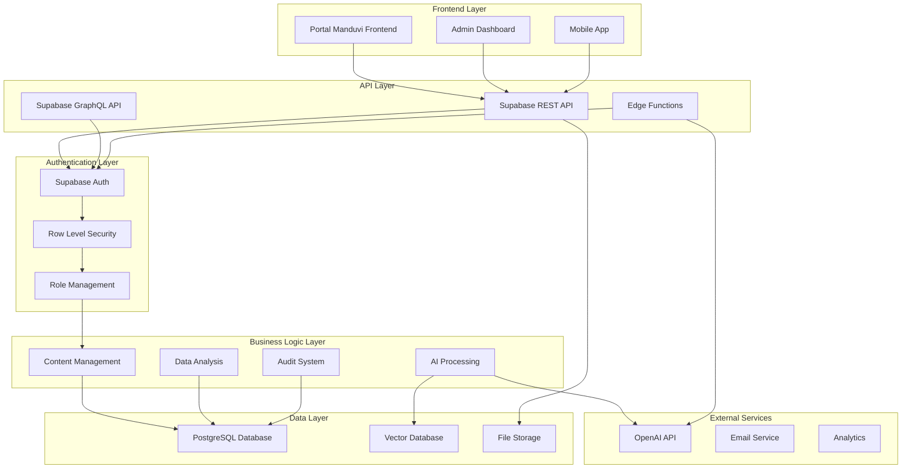
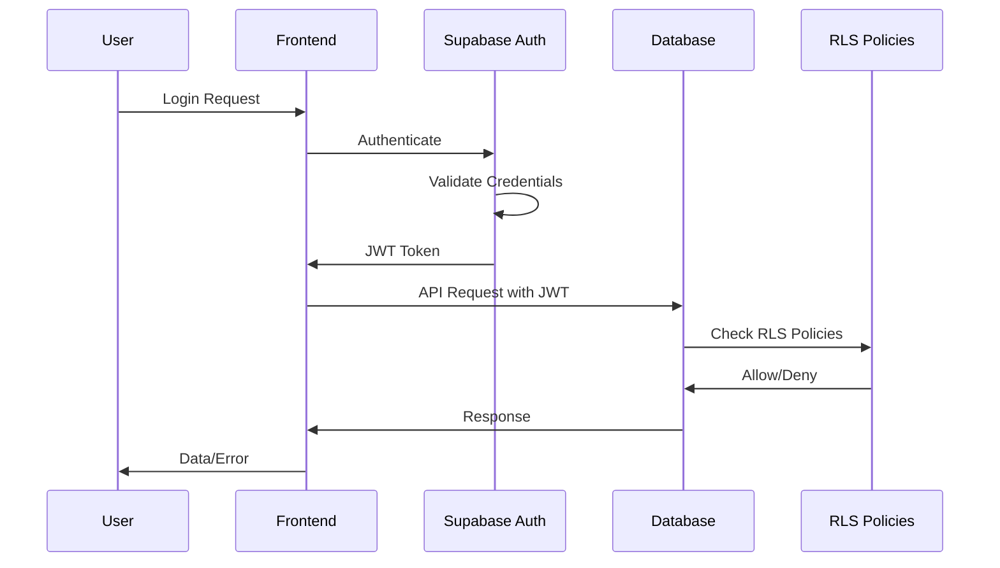
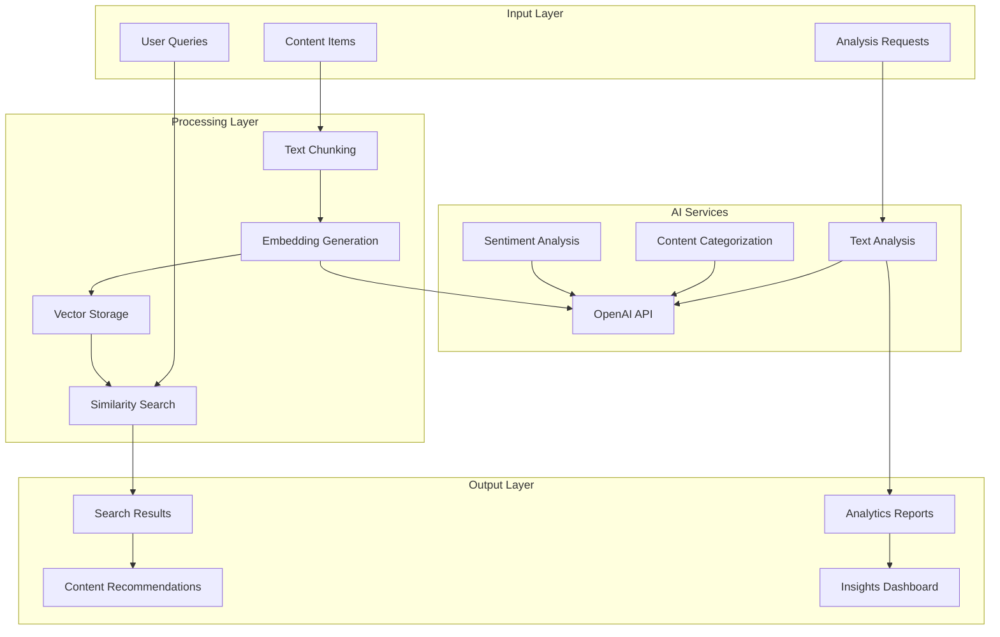
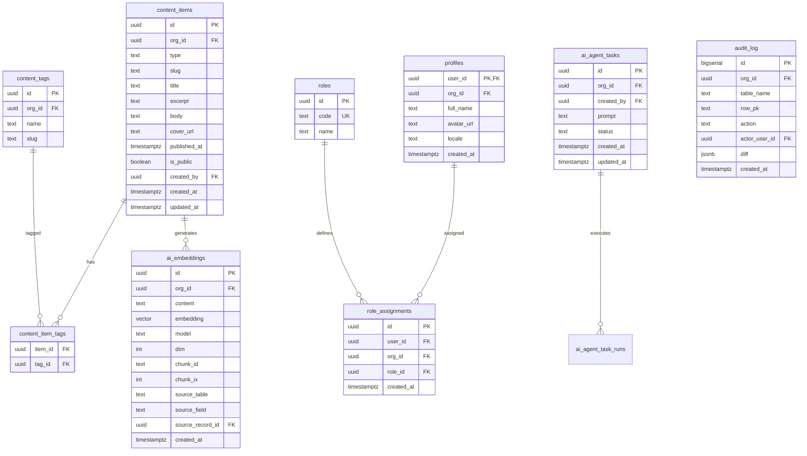
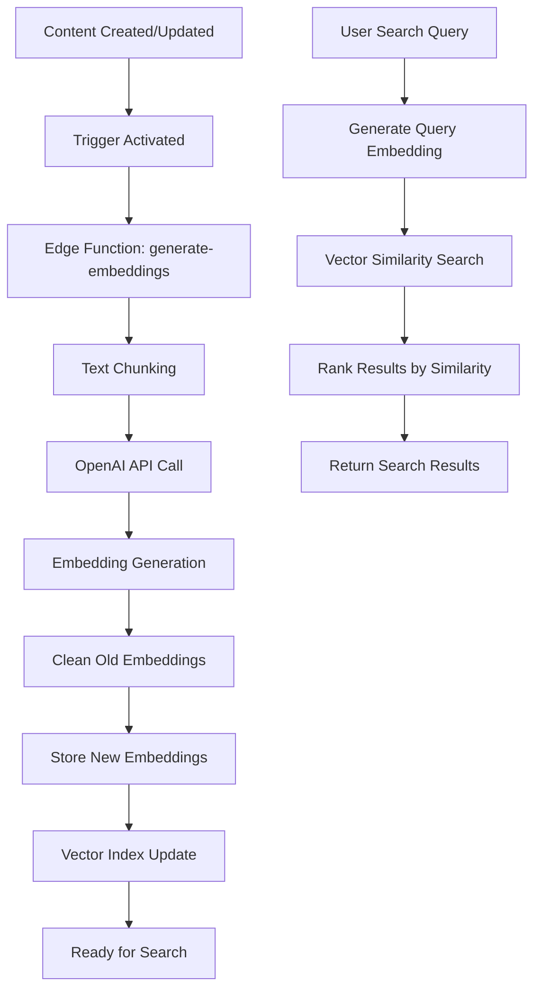
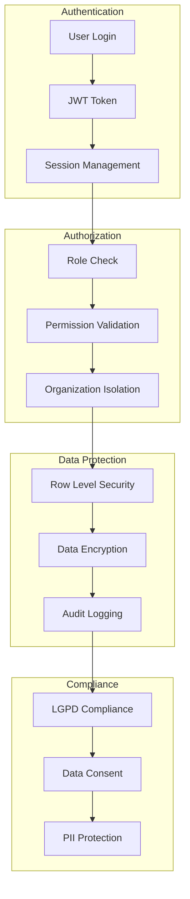
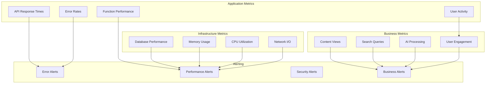
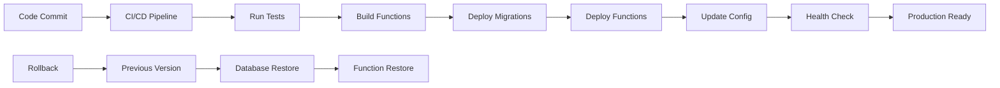
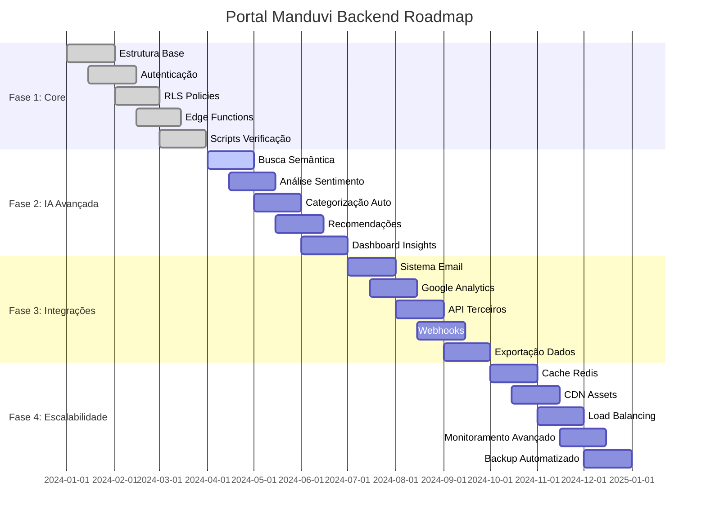

# 🏗️ DIAGRAMAS DE ARQUITETURA - PORTAL MANDUVI BACKEND

## 📊 Visão Geral da Arquitetura

## 🔐 Fluxo de Autenticação

## 🤖 Sistema de IA

## 🗄️ Estrutura do Banco de Dados

## 🔄 Fluxo de Geração de Embeddings

## 🛡️ Sistema de Segurança

## 📊 Monitoramento e Observabilidade

## 🚀 Pipeline de Deploy

## 🔧 Scripts de Verificação

```mermaid
graph TB
    subgraph "Schema Verification"
        A[verify_schema.mjs]
        B[Check Tables]
        C[Check Extensions]
        D[Check Functions]
        E[Check RLS Policies]
    end
    
    subgraph "Security Testing"
        F[verify_rls.mjs]
        G[Test Anonymous Access]
        H[Test Unauthorized Write]
        I[Test Organization Policies]
    end
    
    subgraph "Function Testing"
        J[verify_function.mjs]
        K[Test Edge Functions]
        L[Test OpenAI Integration]
        M[Test Embedding Generation]
    end
    
    subgraph "Configuration Testing"
        N[test_verify.mjs]
        O[Check Environment]
        P[Check Dependencies]
        Q[Check Connectivity]
    end
    
    A --> B
    B --> C
    C --> D
    D --> E
    
    F --> G
    G --> H
    H --> I
    
    J --> K
    K --> L
    L --> M
    
    N --> O
    O --> P
    P --> Q
```

## 📈 Roadmap de Desenvolvimento

## 🎯 Conclusão

Estes diagramas fornecem uma visão visual completa da arquitetura do Portal Manduvi Backend, mostrando:

- **Fluxos de dados** entre componentes
- **Relacionamentos** entre entidades do banco
- **Processos** de autenticação e autorização
- **Integrações** com serviços externos
- **Pipeline** de desenvolvimento e deploy
- **Roadmap** de evolução da plataforma

Cada diagrama pode ser usado para:
- **Documentação** técnica
- **Apresentações** para stakeholders
- **Planejamento** de desenvolvimento
- **Troubleshooting** de problemas
- **Onboarding** de novos desenvolvedores
