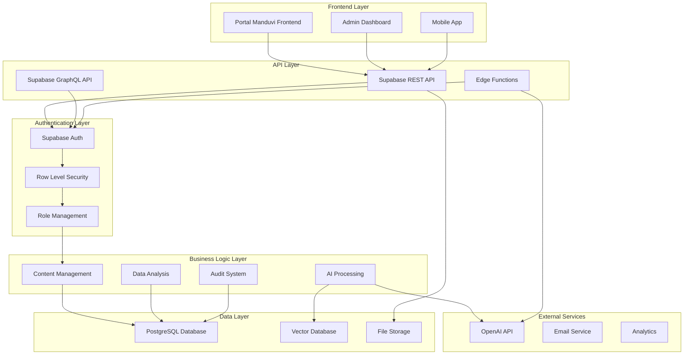
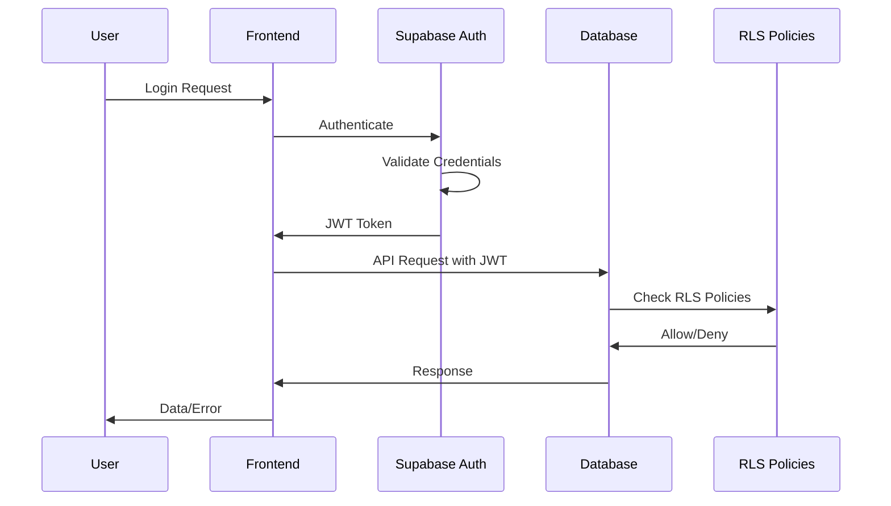
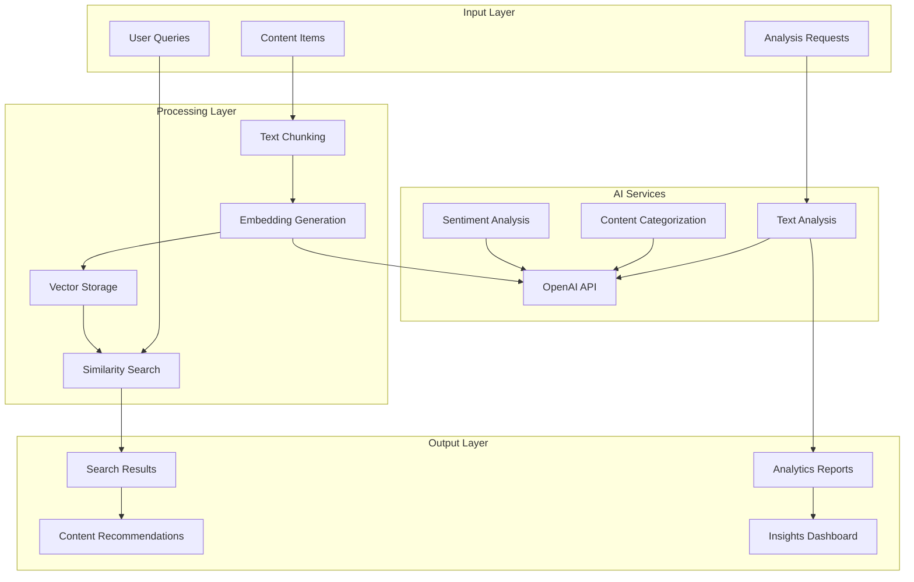

# 🏗️ BLUEPRINT COMPLETO - PORTAL MANDUVI BACKEND

## 📋 Índice

1. [Visão Geral](#-visão-geral)
2. [Arquitetura do Sistema](#-arquitetura-do-sistema)
3. [Stack Tecnológica](#-stack-tecnológica)
4. [Estrutura do Banco de Dados](#-estrutura-do-banco-de-dados)
5. [Edge Functions](#-edge-functions)
6. [APIs e Endpoints](#-apis-e-endpoints)
7. [Sistema de Autenticação](#-sistema-de-autenticação)
8. [Políticas de Segurança](#-políticas-de-segurança)
9. [Sistema de IA](#-sistema-de-ia)
10. [Integrações](#-integrações)
11. [Monitoramento e Logs](#-monitoramento-e-logs)
12. [Deploy e Infraestrutura](#-deploy-e-infraestrutura)
13. [Scripts de Verificação](#-scripts-de-verificação)
14. [Roadmap](#-roadmap)

---

## 🎯 Visão Geral

O Portal Manduvi Backend é uma plataforma completa de gestão de conteúdo e análise de dados sociais/ambientais, construída com Supabase e integrada com IA para fornecer insights acionáveis.

### Objetivos Principais
- **Gestão de Conteúdo**: CMS completo para artigos, iniciativas e editais
- **Análise de Dados**: Processamento e análise de dados sociais/ambientais
- **Inteligência Artificial**: Embeddings, busca semântica e análise automatizada
- **Multi-tenancy**: Suporte a múltiplas organizações com isolamento de dados
- **LGPD Compliance**: Sistema completo de consentimentos e auditoria

---

## 🏛️ Arquitetura do Sistema



---

## 🛠️ Stack Tecnológica

### Backend Core
- **Supabase**: Backend-as-a-Service principal
- **PostgreSQL**: Banco de dados relacional
- **pgvector**: Extensão para embeddings vector
- **Deno**: Runtime para Edge Functions

### Inteligência Artificial
- **OpenAI API**: Geração de embeddings e análise de texto
- **text-embedding-3-small**: Modelo de embeddings
- **GPT-4o-mini**: Análise e processamento de texto

### Desenvolvimento e Deploy
- **Node.js**: Scripts de verificação e utilitários
- **TypeScript**: Tipagem estática
- **Supabase CLI**: Gerenciamento local e deploy
- **Git**: Controle de versão

### Segurança e Compliance
- **Row Level Security (RLS)**: Isolamento de dados
- **JWT**: Autenticação baseada em tokens
- **LGPD Compliance**: Sistema de consentimentos
- **Audit Logging**: Rastreamento de ações

---

## 🗄️ Estrutura do Banco de Dados

### Schema Principal

#### 1. **CMS do Portal (Conteúdo/Tags/Mídia)**

```sql
-- Tabela principal de conteúdo
content_items (
  id UUID PRIMARY KEY,
  org_id UUID NOT NULL,           -- Isolamento por organização
  type TEXT NOT NULL,             -- 'page','post','project_story','dataset','press'
  slug TEXT NOT NULL,             -- URL amigável
  title TEXT NOT NULL,
  excerpt TEXT,
  body TEXT,                      -- Markdown/HTML
  cover_url TEXT,
  published_at TIMESTAMPTZ,
  is_public BOOLEAN DEFAULT true,
  created_by UUID REFERENCES auth.users(id),
  created_at TIMESTAMPTZ DEFAULT now(),
  updated_at TIMESTAMPTZ DEFAULT now(),
  UNIQUE (org_id, slug)
);

-- Sistema de tags
content_tags (
  id UUID PRIMARY KEY,
  org_id UUID NOT NULL,
  name TEXT NOT NULL,
  slug TEXT NOT NULL,
  UNIQUE (org_id, slug)
);

-- Relacionamento many-to-many
content_item_tags (
  item_id UUID REFERENCES content_items(id),
  tag_id UUID REFERENCES content_tags(id),
  PRIMARY KEY (item_id, tag_id)
);

-- Assets de mídia
media_assets (
  id UUID PRIMARY KEY,
  org_id UUID NOT NULL,
  url TEXT NOT NULL,
  mime TEXT,
  meta JSONB,
  created_at TIMESTAMPTZ DEFAULT now()
);
```

#### 2. **Perfis e Papéis (Integração Auth)**

```sql
-- Perfis de usuários
profiles (
  user_id UUID PRIMARY KEY REFERENCES auth.users(id),
  org_id UUID,                    -- Organização preferida
  full_name TEXT,
  avatar_url TEXT,
  locale TEXT DEFAULT 'pt-BR',
  created_at TIMESTAMPTZ DEFAULT now()
);

-- Papéis do sistema
roles (
  id UUID PRIMARY KEY,
  code TEXT UNIQUE NOT NULL,      -- 'visitor','user','editor','admin','sponsor'
  name TEXT NOT NULL
);

-- Atribuições de papéis por organização
role_assignments (
  id UUID PRIMARY KEY,
  user_id UUID NOT NULL REFERENCES auth.users(id),
  org_id UUID NOT NULL,
  role_id UUID NOT NULL REFERENCES roles(id),
  created_at TIMESTAMPTZ DEFAULT now(),
  UNIQUE (user_id, org_id, role_id)
);
```

#### 3. **LGPD/Segurança (Consentimentos, Auditoria, PII)**

```sql
-- Log de auditoria genérico
audit_log (
  id BIGSERIAL PRIMARY KEY,
  org_id UUID,
  table_name TEXT NOT NULL,
  row_pk TEXT NOT NULL,
  action TEXT NOT NULL,           -- 'INSERT','UPDATE','DELETE'
  actor_user_id UUID REFERENCES auth.users(id),
  diff JSONB,
  created_at TIMESTAMPTZ DEFAULT now()
);

-- Consentimentos LGPD
data_consents (
  id UUID PRIMARY KEY,
  subject_type TEXT NOT NULL,     -- 'beneficiary','user'
  subject_id UUID NOT NULL,
  purpose TEXT NOT NULL,          -- 'analytics','communication','research'
  granted BOOLEAN NOT NULL,
  granted_at TIMESTAMPTZ DEFAULT now(),
  revoked_at TIMESTAMPTZ
);

-- Logs de acesso a PII
pii_access_logs (
  id BIGSERIAL PRIMARY KEY,
  actor_user_id UUID REFERENCES auth.users(id),
  org_id UUID,
  subject_type TEXT NOT NULL,
  subject_id UUID NOT NULL,
  action TEXT NOT NULL,           -- 'READ','EXPORT','ERASE_REQUEST'
  reason TEXT,
  created_at TIMESTAMPTZ DEFAULT now()
);
```

#### 4. **IA em Escala (Chunks + Índices + Runs)**

```sql
-- Embeddings vector
ai_embeddings (
  id UUID PRIMARY KEY,
  org_id UUID NOT NULL,
  content TEXT NOT NULL,
  embedding vector(1536) NOT NULL,
  model TEXT DEFAULT 'text-embedding-3-small',
  dim INT DEFAULT 1536,
  chunk_id TEXT,
  chunk_ix INT,
  source_table TEXT,
  source_field TEXT,
  source_record_id UUID,
  created_at TIMESTAMPTZ DEFAULT now()
);

-- Tarefas de IA
ai_agent_tasks (
  id UUID PRIMARY KEY,
  org_id UUID NOT NULL,
  created_by UUID REFERENCES auth.users(id),
  prompt TEXT NOT NULL,
  status ai_task_status DEFAULT 'pending',
  created_at TIMESTAMPTZ DEFAULT now(),
  updated_at TIMESTAMPTZ DEFAULT now()
);

-- Execuções de tarefas
ai_agent_task_runs (
  id UUID PRIMARY KEY,
  task_id UUID NOT NULL REFERENCES ai_agent_tasks(id),
  started_at TIMESTAMPTZ DEFAULT now(),
  finished_at TIMESTAMPTZ,
  status ai_task_status DEFAULT 'in_progress',
  logs TEXT,
  result JSONB
);
```

### Índices e Otimizações

```sql
-- Índice de similaridade para embeddings
CREATE INDEX ai_embeddings_embedding_ivfflat
ON ai_embeddings
USING ivfflat (embedding vector_cosine_ops)
WITH (lists = 100);

-- Índices de performance
CREATE INDEX idx_content_items_org_type_pub ON content_items(org_id, type, is_public, published_at DESC);
CREATE INDEX idx_ai_embeddings_org_source ON ai_embeddings(org_id, source_table, source_record_id);
CREATE INDEX idx_audit_log_org_created ON audit_log(org_id, created_at DESC);
```

---

## ⚡ Edge Functions

### 1. **generate-embeddings**

**Propósito**: Gera embeddings automáticos para busca semântica

**Funcionalidades**:
- Chunking inteligente de texto (500 chars com overlap de 50)
- Integração com OpenAI API
- Limpeza automática de embeddings antigos
- Armazenamento otimizado com metadados

**Input**:
```typescript
{
  record: {
    id: string,
    org_id: string,
    body: string,
    title?: string,
    excerpt?: string
  }
}
```

**Output**:
```typescript
{
  message: string,  // "Generated X embeddings."
  embeddings?: number[][]
}
```

### 2. **process-task-run**

**Propósito**: Processa tarefas de IA em escala

**Tipos de Tarefas**:
- `analyze_articles`: Análise de artigos para insights
- `generate_summaries`: Geração de resumos
- `extract_insights`: Extração de insights
- `categorize_content`: Categorização de conteúdo
- `sentiment_analysis`: Análise de sentimento

**Input**:
```typescript
{
  task_type: string,
  parameters: {
    table_name?: string,
    record_ids?: string[],
    filters?: Record<string, any>,
    options?: Record<string, any>
  },
  priority?: 'low' | 'normal' | 'high'
}
```

**Output**:
```typescript
{
  success: boolean,
  task_id?: string,
  results?: any,
  error?: string,
  status?: 'pending' | 'processing' | 'completed' | 'failed'
}
```

---

## 🔌 APIs e Endpoints

### REST API (Supabase Auto-generated)

#### Content Management
```
GET    /rest/v1/content_items
POST   /rest/v1/content_items
PATCH  /rest/v1/content_items
DELETE /rest/v1/content_items

GET    /rest/v1/content_tags
POST   /rest/v1/content_tags
PATCH  /rest/v1/content_tags
DELETE /rest/v1/content_tags

GET    /rest/v1/media_assets
POST   /rest/v1/media_assets
PATCH  /rest/v1/media_assets
DELETE /rest/v1/media_assets
```

#### User Management
```
GET    /rest/v1/profiles
POST   /rest/v1/profiles
PATCH  /rest/v1/profiles
DELETE /rest/v1/profiles

GET    /rest/v1/roles
GET    /rest/v1/role_assignments
POST   /rest/v1/role_assignments
DELETE /rest/v1/role_assignments
```

#### AI & Analytics
```
GET    /rest/v1/ai_embeddings
POST   /rest/v1/ai_embeddings
DELETE /rest/v1/ai_embeddings

GET    /rest/v1/ai_agent_tasks
POST   /rest/v1/ai_agent_tasks
PATCH  /rest/v1/ai_agent_tasks
DELETE /rest/v1/ai_agent_tasks

GET    /rest/v1/ai_agent_task_runs
POST   /rest/v1/ai_agent_task_runs
PATCH  /rest/v1/ai_agent_task_runs
```

### GraphQL API (Supabase Auto-generated)

```graphql
query GetContentItems($orgId: UUID!, $isPublic: Boolean) {
  content_items(
    where: { 
      org_id: { eq: $orgId }
      is_public: { eq: $isPublic }
    }
    order_by: { published_at: desc }
  ) {
    id
    title
    excerpt
    published_at
    content_tags {
      tag {
        name
        slug
      }
    }
  }
}

query SemanticSearch($query: String!, $orgId: UUID!) {
  semantic_search(
    args: {
      query_text: $query
      org_id_param: $orgId
      similarity_threshold: 0.7
      limit_results: 10
    }
  ) {
    content_item_id
    title
    excerpt
    similarity
    chunk_content
  }
}
```

### Edge Functions Endpoints

```
POST /functions/v1/generate-embeddings
POST /functions/v1/process-task-run
```

---

## 🔐 Sistema de Autenticação

### Fluxo de Autenticação



### Papéis e Permissões

| Papel | Descrição | Permissões |
|-------|-----------|------------|
| `visitor` | Usuário não autenticado | Leitura de conteúdo público |
| `user` | Usuário autenticado | Leitura de conteúdo da org + gerenciamento próprio |
| `editor` | Editor de conteúdo | Gerenciamento de conteúdo da org |
| `admin` | Administrador | Controle total da org + gerenciamento de papéis |
| `sponsor` | Patrocinador | Acesso especial a dados e relatórios |

### Integração com Auth

```typescript
// Exemplo de uso no frontend
const { data: { user }, error } = await supabase.auth.getUser()

if (user) {
  // Usuário autenticado
  const { data: profile } = await supabase
    .from('profiles')
    .select('*')
    .eq('user_id', user.id)
    .single()
}
```

---

## 🛡️ Políticas de Segurança

### Row Level Security (RLS)

#### Políticas por Tabela

**content_items**:
```sql
-- Visitantes veem apenas conteúdo público
CREATE POLICY "Public can view public content"
ON content_items FOR SELECT USING (is_public = true);

-- Usuários veem conteúdo da sua organização
CREATE POLICY "Users can view content from their own org"
ON content_items FOR SELECT USING (
  EXISTS (
    SELECT 1 FROM role_assignments
    WHERE user_id = auth.uid() AND org_id = content_items.org_id
  )
);

-- Editores/Admins gerenciam conteúdo da org
CREATE POLICY "Editors and Admins can manage content in their org"
ON content_items FOR ALL USING (
  EXISTS (
    SELECT 1 FROM role_assignments ra
    JOIN roles r ON r.id = ra.role_id
    WHERE ra.user_id = auth.uid()
      AND ra.org_id = content_items.org_id
      AND r.code IN ('editor', 'admin')
  )
);
```

**role_assignments** (Segurança Máxima):
```sql
-- Apenas admins veem atribuições
CREATE POLICY "Admins can view role assignments in their org"
ON role_assignments FOR SELECT USING (
  EXISTS (
    SELECT 1 FROM role_assignments ra
    JOIN roles r ON r.id = ra.role_id
    WHERE ra.user_id = auth.uid()
      AND ra.org_id = role_assignments.org_id
      AND r.code = 'admin'
  )
);
```

### Isolamento por Organização

Todas as políticas implementam isolamento baseado em `org_id`:

```sql
-- Exemplo de política genérica
CREATE POLICY "org_isolation_policy"
ON table_name FOR ALL USING (
  org_id = (
    SELECT org_id FROM role_assignments
    WHERE user_id = auth.uid()
    LIMIT 1
  )
);
```

---

## 🤖 Sistema de IA

### Arquitetura de IA



### Funcionalidades de IA

#### 1. **Busca Semântica**
```sql
-- Função de busca semântica
SELECT * FROM semantic_search(
  'sustentabilidade ambiental',
  'uuid-da-organizacao',
  0.7,  -- threshold de similaridade
  10    -- limite de resultados
);
```

#### 2. **Conteúdo Similar**
```sql
-- Encontrar conteúdo similar
SELECT * FROM find_similar_content(
  'uuid-do-item',
  'uuid-da-organizacao',
  0.8,  -- threshold de similaridade
  5     -- limite de resultados
);
```

#### 3. **Análise Automática**
- **Categorização**: Classifica conteúdo automaticamente
- **Resumos**: Gera resumos de artigos longos
- **Insights**: Extrai insights e tendências
- **Sentimento**: Analisa sentimento do conteúdo

### Processamento de Embeddings

#### Chunking Inteligente
```typescript
function chunkText(text: string, size = 500, overlap = 50) {
  const chunks = [];
  let i = 0;
  while (i < text.length) {
    const end = Math.min(i + size, text.length);
    chunks.push(text.slice(i, end));
    i += size - overlap;
  }
  return chunks;
}
```

#### Geração Automática
- **Trigger**: Automático quando conteúdo é criado/atualizado
- **Modelo**: `text-embedding-3-small` (OpenAI)
- **Dimensões**: 1536 (otimizado para performance)
- **Armazenamento**: PostgreSQL com extensão `pgvector`

---

## 🔗 Integrações

### OpenAI Integration

```typescript
// Configuração da API
const openai = new OpenAI({ 
  apiKey: Deno.env.get("OPENAI_API_KEY")! 
});

// Geração de embeddings
const embeddingResponse = await openai.createEmbeddings({
  model: 'text-embedding-3-small',
  input: chunk,
});

// Análise de texto
const analysisResponse = await openai.chat.completions.create({
  model: 'gpt-4o-mini',
  messages: [
    { role: 'system', content: 'You are an expert content analyst.' },
    { role: 'user', content: prompt }
  ],
  temperature: 0.7
});
```

### Email Service (Futuro)
- **Supabase Edge Functions** para envio de emails
- **Templates** para notificações e relatórios
- **Integração** com sistema de consentimentos

### Analytics (Futuro)
- **Google Analytics** para métricas de uso
- **Custom Events** para tracking de funcionalidades
- **Dashboards** para administradores

---

## 📊 Monitoramento e Logs

### Sistema de Auditoria

```sql
-- Log automático de todas as operações
CREATE TRIGGER audit_content_items_trigger
    AFTER INSERT OR UPDATE OR DELETE ON content_items
    FOR EACH ROW EXECUTE FUNCTION public.audit_trigger_function();
```

### Métricas de Performance

#### Embeddings
```sql
-- Estatísticas de embeddings
SELECT * FROM get_embedding_stats('uuid-da-organizacao');
```

#### Uso da API
- **Rate Limiting**: Por usuário e organização
- **Usage Tracking**: Métricas de uso por endpoint
- **Error Monitoring**: Logs de erros e exceções

### Alertas e Notificações

- **Erro de Embeddings**: Falha na geração
- **Uso Excessivo**: Rate limit excedido
- **Falhas de Segurança**: Tentativas de acesso não autorizado
- **Performance**: Tempo de resposta elevado

---

## 🚀 Deploy e Infraestrutura

### Ambiente de Desenvolvimento

```bash
# Configuração local
supabase start
supabase db reset
supabase functions serve

# Scripts de verificação
npm run verify-schema
npm run verify-rls
npm run verify-function
```

### Ambiente de Produção

```bash
# Deploy das migrações
supabase db push

# Deploy das Edge Functions
supabase functions deploy generate-embeddings
supabase functions deploy process-task-run

# Deploy de configurações
supabase config push
```

### CI/CD Pipeline (Futuro)

```yaml
# .github/workflows/deploy.yml
name: Deploy to Production
on:
  push:
    branches: [main]
jobs:
  deploy:
    runs-on: ubuntu-latest
    steps:
      - uses: actions/checkout@v2
      - name: Deploy to Supabase
        run: |
          supabase db push
          supabase functions deploy
```

---

## 🔍 Scripts de Verificação

### 1. **verify_schema.mjs**
- Verifica estrutura do banco de dados
- Lista tabelas, extensões e funções
- Valida configurações RLS

### 2. **verify_rls.mjs**
- Testa políticas de segurança
- Verifica isolamento por organização
- Valida controle de acesso

### 3. **verify_function.mjs**
- Testa Edge Functions
- Verifica integração com OpenAI
- Valida geração de embeddings

### 4. **test_verify.mjs**
- Verifica configuração do ambiente
- Valida variáveis de ambiente
- Testa conectividade

### 5. **demo_scripts.mjs**
- Demonstração de todos os scripts
- Guia de uso completo
- Troubleshooting

---

## 🗺️ Roadmap

### Fase 1: Core (✅ Concluída)
- [x] Estrutura base do banco de dados
- [x] Sistema de autenticação e papéis
- [x] Políticas RLS implementadas
- [x] Edge Functions básicas
- [x] Scripts de verificação

### Fase 2: IA Avançada (🔄 Em Progresso)
- [ ] Busca semântica otimizada
- [ ] Análise de sentimento em tempo real
- [ ] Categorização automática avançada
- [ ] Recomendações personalizadas
- [ ] Dashboard de insights

### Fase 3: Integrações (📋 Planejada)
- [ ] Sistema de notificações por email
- [ ] Integração com Google Analytics
- [ ] API para terceiros
- [ ] Webhooks para eventos
- [ ] Exportação de dados

### Fase 4: Escalabilidade (📋 Planejada)
- [ ] Cache Redis para performance
- [ ] CDN para assets estáticos
- [ ] Load balancing
- [ ] Monitoramento avançado
- [ ] Backup automatizado

### Fase 5: Funcionalidades Avançadas (📋 Planejada)
- [ ] Sistema de workflows
- [ ] Aprovação de conteúdo
- [ ] Versionamento de conteúdo
- [ ] Colaboração em tempo real
- [ ] Mobile app nativo

---

## 📚 Documentação Técnica

### Arquivos de Documentação
- `README.md` - Documentação principal
- `BLUEPRINT.md` - Este documento (arquitetura completa)
- `VERIFY_SCHEMA.md` - Documentação do script de schema
- `VERIFY_RLS.md` - Documentação do script de RLS
- `VERIFY_FUNCTION.md` - Documentação do script de Edge Function

### Estrutura de Pastas
```
portal-manduvi-backend/
├── supabase/
│   ├── migrations/           # Migrações do banco
│   ├── functions/            # Edge Functions
│   └── config.toml          # Configuração do Supabase
├── scripts/                 # Scripts de verificação
├── docs/                   # Documentação adicional
├── tests/                  # Testes automatizados
└── package.json            # Dependências Node.js
```

---

## 🎯 Conclusão

O Portal Manduvi Backend é uma solução completa e robusta que combina:

- **Arquitetura Moderna**: Supabase + PostgreSQL + IA
- **Segurança Avançada**: RLS + LGPD + Auditoria
- **Escalabilidade**: Multi-tenancy + Edge Functions
- **Inteligência Artificial**: Embeddings + Análise + Busca Semântica
- **Monitoramento**: Scripts de verificação + Logs + Métricas

A plataforma está preparada para crescer e evoluir, oferecendo uma base sólida para o desenvolvimento de funcionalidades avançadas de gestão de conteúdo e análise de dados sociais/ambientais.

---

**Desenvolvido com ❤️ para o Portal Manduvi**
