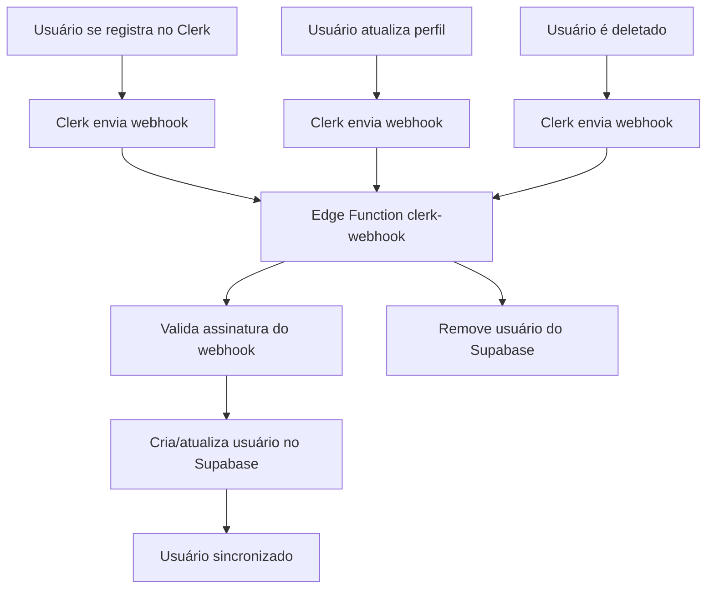

# 🔗 WEBHOOK DO CLERK - PORTAL MANDUVI BACKEND

## 🎯 Visão Geral

O Webhook do Clerk é uma Edge Function que recebe eventos de autenticação do Clerk e sincroniza automaticamente os usuários com o sistema de autenticação do Supabase. Isso permite integração perfeita entre o Clerk (frontend) e o Supabase (backend).

---

## 🏗️ Como Funciona

### **Fluxo de Integração**


### **Eventos Suportados**
- **`user.created`**: Novo usuário registrado
- **`user.updated`**: Perfil de usuário atualizado
- **`user.deleted`**: Usuário removido

---

## 🔧 Configuração

### **Pré-requisitos**

#### 1. **Edge Function Deployada**
```bash
# A função já foi deployada
supabase functions deploy clerk-webhook
```

#### 2. **Variável de Ambiente**
```bash
# No painel Supabase: Settings > Edge Functions
# Adicionar variável:
CLERK_WEBHOOK_SECRET_KEY = [seu_webhook_secret_do_clerk]
```

#### 3. **Configuração no Clerk**
```bash
# No painel do Clerk: Webhooks
# Endpoint URL: https://ygnxdxkykkdflaswegwn.supabase.co/functions/v1/clerk-webhook
# Eventos: user.created, user.updated, user.deleted
```

### **Passos de Configuração**

#### **Passo 1: Configurar Variável de Ambiente**
1. Acesse o painel do Supabase
2. Vá para Settings > Edge Functions
3. Adicione a variável `CLERK_WEBHOOK_SECRET_KEY`
4. Cole o valor do webhook secret do Clerk

#### **Passo 2: Configurar Webhook no Clerk**
1. Acesse o painel do Clerk
2. Vá para Webhooks
3. Clique em "Add Endpoint"
4. Configure:
   - **Endpoint URL**: `https://ygnxdxkykkdflaswegwn.supabase.co/functions/v1/clerk-webhook`
   - **Events**: `user.created`, `user.updated`, `user.deleted`
   - **Secret**: Copie o valor para usar no Supabase

#### **Passo 3: Testar Configuração**
```bash
# Testar a Edge Function
npm run test-clerk-webhook
```

---

## 📋 Código da Edge Function

### **Estrutura da Função**
```typescript
// supabase/functions/clerk-webhook/index.ts

import { createClient } from 'https://esm.sh/@supabase/supabase-js@2.39.0'
import { Webhook } from 'https://esm.sh/svix@1.15.0'

// Tipos para os dados do evento do Clerk
type User = {
  id: string
  email_addresses: {
    id: string
    email_address: string
  }[]
  primary_email_address_id: string
  first_name: string
  last_name: string
  image_url: string
  created_at: number
  updated_at: number
}

type Event = {
  data: User
  object: 'event'
  type: 'user.created' | 'user.updated' | 'user.deleted'
}
```

### **Validação de Segurança**
```typescript
// 1. Obter o segredo do webhook
const WEBHOOK_SECRET = Deno.env.get('CLERK_WEBHOOK_SECRET_KEY')

// 2. Validar assinatura do webhook
const headers = Object.fromEntries(req.headers)
const payload = await req.json()
const svix_id = headers['svix-id']
const svix_timestamp = headers['svix-timestamp']
const svix_signature = headers['svix-signature']

// 3. Verificar assinatura com svix
const wh = new Webhook(WEBHOOK_SECRET)
const evt = wh.verify(JSON.stringify(payload), {
  'svix-id': svix_id,
  'svix-timestamp': svix_timestamp,
  'svix-signature': svix_signature,
}) as Event
```

### **Sincronização de Usuários**
```typescript
// 4. Sincronizar com Supabase Auth
const supabaseAdmin = createClient(
  Deno.env.get('SUPABASE_URL') ?? '',
  Deno.env.get('SUPABASE_SERVICE_ROLE_KEY') ?? ''
)

if (eventType === 'user.created' || eventType === 'user.updated') {
  // Tentar atualizar usuário existente
  const { data, error } = await supabaseAdmin.auth.admin.updateUserById(
    id,
    { email: primaryEmail, user_metadata: attributes }
  )
  
  if (error && error.message.includes('User not found')) {
    // Criar novo usuário se não existir
    const { data: newUser, error: newUserError } = await supabaseAdmin.auth.admin.createUser({
      id: id,
      email: primaryEmail,
      user_metadata: attributes,
      email_confirm: true
    })
  }
} else if (eventType === 'user.deleted') {
  // Remover usuário
  const { error } = await supabaseAdmin.auth.admin.deleteUser(id)
}
```

---

## 🧪 Testes e Verificação

### **Script de Teste Automático**
```bash
# Executar teste completo do webhook
npm run test-clerk-webhook
```

### **Teste Manual via Clerk**
1. No painel do Clerk, vá para Webhooks
2. Clique em "Send Test Webhook"
3. Selecione o evento `user.created`
4. Verifique se o usuário foi criado no Supabase

### **Verificação de Logs**
```bash
# Ver logs da Edge Function
supabase functions logs clerk-webhook

# Ou no painel Supabase: Edge Functions > clerk-webhook > Logs
```

### **Verificação de Usuários**
```sql
-- Verificar usuários criados
SELECT 
  id,
  email,
  user_metadata,
  created_at
FROM auth.users 
ORDER BY created_at DESC;

-- Verificar perfis sincronizados
SELECT 
  user_id,
  full_name,
  avatar_url,
  created_at
FROM profiles 
ORDER BY created_at DESC;
```

---

## 📊 Exemplo de Payload

### **Evento user.created**
```json
{
  "data": {
    "id": "user_123456789",
    "email_addresses": [
      {
        "id": "email_123",
        "email_address": "usuario@exemplo.com"
      }
    ],
    "primary_email_address_id": "email_123",
    "first_name": "João",
    "last_name": "Silva",
    "image_url": "https://example.com/avatar.jpg",
    "created_at": 1640995200,
    "updated_at": 1640995200
  },
  "object": "event",
  "type": "user.created"
}
```

### **Evento user.updated**
```json
{
  "data": {
    "id": "user_123456789",
    "email_addresses": [
      {
        "id": "email_123",
        "email_address": "novoemail@exemplo.com"
      }
    ],
    "primary_email_address_id": "email_123",
    "first_name": "João",
    "last_name": "Santos",
    "image_url": "https://example.com/novo-avatar.jpg",
    "created_at": 1640995200,
    "updated_at": 1640995300
  },
  "object": "event",
  "type": "user.updated"
}
```

### **Evento user.deleted**
```json
{
  "data": {
    "id": "user_123456789",
    "email_addresses": [],
    "primary_email_address_id": null,
    "first_name": null,
    "last_name": null,
    "image_url": null,
    "created_at": 1640995200,
    "updated_at": 1640995400
  },
  "object": "event",
  "type": "user.deleted"
}
```

---

## 🔍 Troubleshooting

### **Problemas Comuns**

#### **1. Erro de Assinatura**
```
Error: Webhook signature verification failed
```
**Solução**: Verificar se `CLERK_WEBHOOK_SECRET_KEY` está configurado corretamente

#### **2. Headers Ausentes**
```
Error: Missing svix headers
```
**Solução**: Verificar se o webhook está sendo enviado pelo Clerk com os headers corretos

#### **3. Usuário Não Criado**
```
User not found
```
**Solução**: Verificar se a função tem permissões de administrador no Supabase

#### **4. Erro de Permissão**
```
Insufficient permissions
```
**Solução**: Verificar se `SUPABASE_SERVICE_ROLE_KEY` está configurada

### **Logs de Debug**
```typescript
// Adicionar logs para debug
console.log('Webhook received:', {
  eventType: evt.type,
  userId: evt.data.id,
  email: primaryEmail,
  timestamp: new Date().toISOString()
});
```

### **Verificação de Configuração**
```bash
# Verificar variáveis de ambiente
supabase functions env list

# Verificar logs em tempo real
supabase functions logs clerk-webhook --follow
```

---

## 🚀 Otimizações

### **Performance**
- **Processamento Assíncrono**: Webhook responde rapidamente
- **Validação Eficiente**: Verificação de assinatura otimizada
- **Caching**: Reutilização de conexões Supabase

### **Confiabilidade**
- **Tratamento de Erros**: Falhas não afetam o sistema
- **Logs Completos**: Rastreamento de todas as operações
- **Retry Logic**: Possibilidade de reprocessamento

### **Segurança**
- **Validação de Assinatura**: Verificação com svix
- **Headers Obrigatórios**: Validação de headers do Clerk
- **Permissões Mínimas**: Uso de service role apenas quando necessário

---

## 📚 Scripts Disponíveis

### **Teste e Verificação**
```bash
npm run test-clerk-webhook  # Testar Edge Function
npm run verify-schema       # Verificar schema do banco
npm run verify-rls          # Testar políticas de segurança
```

### **Deploy e Configuração**
```bash
supabase functions deploy clerk-webhook  # Deploy da função
supabase functions logs clerk-webhook    # Ver logs
supabase functions env list              # Ver variáveis de ambiente
```

---

## 🎯 Próximos Passos

### **Melhorias Planejadas**
- [ ] **Sincronização de Perfis**: Criar/atualizar tabela profiles automaticamente
- [ ] **Validação de Dados**: Validação mais robusta dos dados do Clerk
- [ ] **Retry Logic**: Tentar novamente em caso de falha
- [ ] **Monitoring**: Dashboard de métricas do webhook
- [ ] **Rate Limiting**: Controle de frequência de webhooks

### **Integrações Futuras**
- [ ] **Notificações**: Enviar emails de boas-vindas
- [ ] **Analytics**: Tracking de eventos de usuário
- [ ] **Backup**: Backup automático de dados de usuário
- [ ] **Audit**: Logs de auditoria para compliance

---

## 📖 Documentação Relacionada

- [BLUEPRINT.md](./BLUEPRINT.md) - Arquitetura completa
- [TECHNICAL_SPECS.md](./TECHNICAL_SPECS.md) - Especificações técnicas
- [VERIFY_FUNCTION.md](./VERIFY_FUNCTION.md) - Testes de Edge Function
- [README.md](./README.md) - Documentação principal

---

**Desenvolvido com ❤️ para o Portal Manduvi**

*Integrando Clerk e Supabase para autenticação perfeita.*
