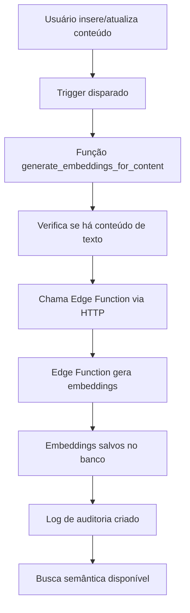

# ⚡ TRIGGER DE EMBEDDINGS - PORTAL MANDUVI BACKEND

## 🎯 Visão Geral

O Trigger de Embeddings é um sistema automatizado que gera embeddings vectoriais sempre que conteúdo é inserido ou atualizado na tabela `content_items`. Isso permite busca semântica inteligente e análise de conteúdo em tempo real.

---

## 🏗️ Como Funciona

### **Fluxo Automático**


### **Componentes do Sistema**

#### 1. **Trigger Database**
- **Nome**: `on_content_item_change`
- **Tabela**: `content_items`
- **Evento**: `AFTER INSERT OR UPDATE`
- **Função**: `generate_embeddings_for_content()`

#### 2. **Função do Trigger**
- **Nome**: `generate_embeddings_for_content()`
- **Linguagem**: PL/pgSQL
- **Segurança**: `SECURITY DEFINER`
- **Funcionalidade**: Chama Edge Function via HTTP

#### 3. **Edge Function**
- **Nome**: `generate-embeddings`
- **Runtime**: Deno
- **API**: OpenAI (text-embedding-3-small)
- **Processo**: Chunking + Embedding + Armazenamento

---

## 🔧 Configuração

### **Pré-requisitos**

#### 1. **Extensões PostgreSQL**
```sql
-- Extensões necessárias
CREATE EXTENSION IF NOT EXISTS http;
CREATE EXTENSION IF NOT EXISTS pg_net;
```

#### 2. **Vault Configuration**
```sql
-- Segredo no Vault do Supabase
Name: SUPABASE_SERVICE_ROLE_KEY
Secret: [sua_service_role_key_completa]
```

#### 3. **Edge Function Deployada**
```bash
supabase functions deploy generate-embeddings
```

### **Passos de Configuração**

#### **Passo 1: Aplicar Migração**
```bash
# Aplicar a migração do trigger
supabase db push
```

#### **Passo 2: Configurar Vault**
```bash
# Configurar automaticamente
npm run setup-vault

# Ou configurar manualmente no painel Supabase:
# Settings > Vault > New Secret
# Name: SUPABASE_SERVICE_ROLE_KEY
# Secret: [sua_service_role_key]
```

#### **Passo 3: Verificar Extensões**
```bash
# No painel Supabase: Database > Extensions
# Ativar: http e pg_net
```

#### **Passo 4: Deploy Edge Function**
```bash
supabase functions deploy generate-embeddings
```

#### **Passo 5: Testar Sistema**
```bash
npm run test-trigger
```

---

## 📋 Código SQL

### **Função do Trigger**
```sql
CREATE OR REPLACE FUNCTION generate_embeddings_for_content()
RETURNS TRIGGER
LANGUAGE plpgsql
SECURITY DEFINER
AS $$
DECLARE
  request_id bigint;
BEGIN
  -- Verifica se o conteúdo tem body (texto para gerar embeddings)
  IF NEW.body IS NULL OR TRIM(NEW.body) = '' THEN
    RETURN NEW;
  END IF;

  -- Invoca a Edge Function 'generate-embeddings' de forma assíncrona
  SELECT INTO request_id
    net.http_post(
      url := current_setting('app.settings.supabase_url') || '/functions/v1/generate-embeddings',
      headers := jsonb_build_object(
        'Content-Type', 'application/json',
        'Authorization', 'Bearer ' || supabase_secret()
      ),
      body := jsonb_build_object(
        'record', jsonb_build_object(
          'id', NEW.id,
          'org_id', NEW.org_id,
          'body', NEW.body,
          'title', NEW.title,
          'excerpt', NEW.excerpt
        )
      )
    );

  -- Log da operação
  INSERT INTO audit_log (
    org_id, table_name, row_pk, action, actor_user_id, diff
  ) VALUES (
    NEW.org_id, 'content_items', NEW.id::text, 'EMBEDDING_TRIGGER',
    NEW.created_by, jsonb_build_object(
      'trigger_fired', true,
      'request_id', request_id,
      'content_length', length(NEW.body)
    )
  );

  RETURN NEW;
EXCEPTION
  WHEN OTHERS THEN
    -- Log de erro
    INSERT INTO audit_log (
      org_id, table_name, row_pk, action, actor_user_id, diff
    ) VALUES (
      NEW.org_id, 'content_items', NEW.id::text, 'EMBEDDING_TRIGGER_ERROR',
      NEW.created_by, jsonb_build_object(
        'error', SQLERRM,
        'error_code', SQLSTATE
      )
    );
    
    RETURN NEW;
END;
$$;
```

### **Função Auxiliar para Vault**
```sql
CREATE OR REPLACE FUNCTION supabase_secret()
RETURNS text
LANGUAGE sql
STABLE
SECURITY DEFINER
AS $$
  SELECT decrypted_secret FROM vault.decrypted_secrets WHERE name = 'SUPABASE_SERVICE_ROLE_KEY';
$$;
```

### **Trigger**
```sql
CREATE TRIGGER on_content_item_change
  AFTER INSERT OR UPDATE ON content_items
  FOR EACH ROW
  EXECUTE FUNCTION generate_embeddings_for_content();
```

### **Função de Teste Manual**
```sql
CREATE OR REPLACE FUNCTION test_embedding_trigger(content_id UUID)
RETURNS jsonb
LANGUAGE plpgsql
SECURITY DEFINER
AS $$
DECLARE
  content_record content_items%ROWTYPE;
  request_id bigint;
BEGIN
  -- Busca o registro de conteúdo
  SELECT * INTO content_record
  FROM content_items
  WHERE id = content_id;
  
  IF NOT FOUND THEN
    RETURN jsonb_build_object('success', false, 'error', 'Content item not found');
  END IF;
  
  -- Chama a função de geração de embeddings
  SELECT INTO request_id
    net.http_post(
      url := get_supabase_url() || '/functions/v1/generate-embeddings',
      headers := jsonb_build_object(
        'Content-Type', 'application/json',
        'Authorization', 'Bearer ' || supabase_secret()
      ),
      body := jsonb_build_object(
        'record', jsonb_build_object(
          'id', content_record.id,
          'org_id', content_record.org_id,
          'body', content_record.body,
          'title', content_record.title,
          'excerpt', content_record.excerpt
        )
      )
    );
  
  RETURN jsonb_build_object(
    'success', true,
    'request_id', request_id,
    'content_id', content_id,
    'message', 'Embedding generation triggered successfully'
  );
EXCEPTION
  WHEN OTHERS THEN
    RETURN jsonb_build_object(
      'success', false,
      'error', SQLERRM,
      'error_code', SQLSTATE
    );
END;
$$;
```

---

## 🧪 Testes e Verificação

### **Script de Teste Automático**
```bash
# Executar teste completo do trigger
npm run test-trigger
```

### **Teste Manual via SQL**
```sql
-- Testar função de trigger manual
SELECT test_embedding_trigger('uuid-do-conteudo');

-- Verificar embeddings gerados
SELECT * FROM ai_embeddings WHERE source_record_id = 'uuid-do-conteudo';

-- Verificar logs de auditoria
SELECT * FROM audit_log 
WHERE row_pk = 'uuid-do-conteudo' 
ORDER BY created_at DESC;
```

### **Teste de Inserção**
```sql
-- Inserir conteúdo de teste
INSERT INTO content_items (
  org_id, type, slug, title, body, is_public
) VALUES (
  '876e4567-e89b-12d3-a456-426614174000',
  'post',
  'teste-trigger',
  'Teste do Trigger',
  'Este é um conteúdo de teste para verificar se o trigger está funcionando.',
  true
);

-- Verificar se embeddings foram gerados
SELECT COUNT(*) FROM ai_embeddings 
WHERE source_record_id = (
  SELECT id FROM content_items WHERE slug = 'teste-trigger'
);
```

---

## 📊 Monitoramento

### **Logs de Auditoria**
```sql
-- Ver logs do trigger
SELECT 
  action,
  created_at,
  diff
FROM audit_log 
WHERE action IN ('EMBEDDING_TRIGGER', 'EMBEDDING_TRIGGER_ERROR')
ORDER BY created_at DESC;
```

### **Métricas de Performance**
```sql
-- Estatísticas de embeddings
SELECT 
  source_table,
  COUNT(*) as total_embeddings,
  COUNT(DISTINCT source_record_id) as unique_records,
  AVG(length(content)) as avg_content_length
FROM ai_embeddings 
GROUP BY source_table;
```

### **Verificação de Saúde**
```sql
-- Verificar se trigger está ativo
SELECT 
  tgname as trigger_name,
  tgrelid::regclass as table_name,
  tgenabled as enabled
FROM pg_trigger 
WHERE tgname = 'on_content_item_change';
```

---

## 🔍 Troubleshooting

### **Problemas Comuns**

#### **1. Trigger não dispara**
```sql
-- Verificar se trigger existe
SELECT * FROM pg_trigger WHERE tgname = 'on_content_item_change';

-- Verificar se está habilitado
SELECT tgenabled FROM pg_trigger WHERE tgname = 'on_content_item_change';
```

#### **2. Erro de Vault**
```sql
-- Testar função do Vault
SELECT supabase_secret();

-- Verificar se segredo existe
SELECT name FROM vault.decrypted_secrets WHERE name = 'SUPABASE_SERVICE_ROLE_KEY';
```

#### **3. Erro de Extensão**
```sql
-- Verificar extensões ativas
SELECT extname FROM pg_extension WHERE extname IN ('http', 'pg_net');
```

#### **4. Erro de Edge Function**
```bash
# Verificar se Edge Function está deployada
supabase functions list

# Ver logs da Edge Function
supabase functions logs generate-embeddings
```

### **Logs de Erro**
```sql
-- Ver erros do trigger
SELECT 
  action,
  created_at,
  diff->>'error' as error_message,
  diff->>'error_code' as error_code
FROM audit_log 
WHERE action = 'EMBEDDING_TRIGGER_ERROR'
ORDER BY created_at DESC;
```

---

## 🚀 Otimizações

### **Performance**
- **Chunking Inteligente**: Textos longos são divididos em chunks de 500 caracteres
- **Processamento Assíncrono**: Trigger não bloqueia a operação principal
- **Cache de Embeddings**: Embeddings antigos são removidos antes de gerar novos
- **Índices Vector**: Busca semântica otimizada com pgvector

### **Confiabilidade**
- **Tratamento de Erros**: Falhas não afetam a operação principal
- **Logs de Auditoria**: Rastreamento completo de operações
- **Retry Logic**: Edge Function pode ser chamada novamente
- **Validação**: Verifica se conteúdo tem texto antes de processar

### **Segurança**
- **SECURITY DEFINER**: Função executa com permissões elevadas
- **Vault Integration**: Chaves armazenadas de forma segura
- **Isolamento por Org**: Embeddings isolados por organização
- **Auditoria**: Log de todas as operações

---

## 📚 Scripts Disponíveis

### **Configuração**
```bash
npm run setup-vault      # Configurar Vault automaticamente
npm run test-trigger     # Testar trigger completo
```

### **Verificação**
```bash
npm run verify-schema    # Verificar schema do banco
npm run verify-function  # Testar Edge Function
npm run verify-rls       # Testar políticas de segurança
```

### **Deploy**
```bash
supabase db push                    # Aplicar migrações
supabase functions deploy generate-embeddings  # Deploy Edge Function
```

---

## 🎯 Próximos Passos

### **Melhorias Planejadas**
- [ ] **Batch Processing**: Processar múltiplos conteúdos simultaneamente
- [ ] **Retry Logic**: Tentar novamente em caso de falha
- [ ] **Rate Limiting**: Controlar frequência de chamadas
- [ ] **Monitoring**: Dashboard de métricas do trigger
- [ ] **Optimization**: Cache de embeddings similares

### **Integrações Futuras**
- [ ] **Webhooks**: Notificar sistemas externos
- [ ] **Analytics**: Métricas de uso do trigger
- [ ] **Alerts**: Notificações de falhas
- [ ] **Backup**: Backup automático de embeddings

---

## 📖 Documentação Relacionada

- [BLUEPRINT.md](./BLUEPRINT.md) - Arquitetura completa
- [TECHNICAL_SPECS.md](./TECHNICAL_SPECS.md) - Especificações técnicas
- [VERIFY_FUNCTION.md](./VERIFY_FUNCTION.md) - Testes de Edge Function
- [README.md](./README.md) - Documentação principal

---

**Desenvolvido com ❤️ para o Portal Manduvi**

*Automatizando a geração de embeddings para busca semântica inteligente.*
